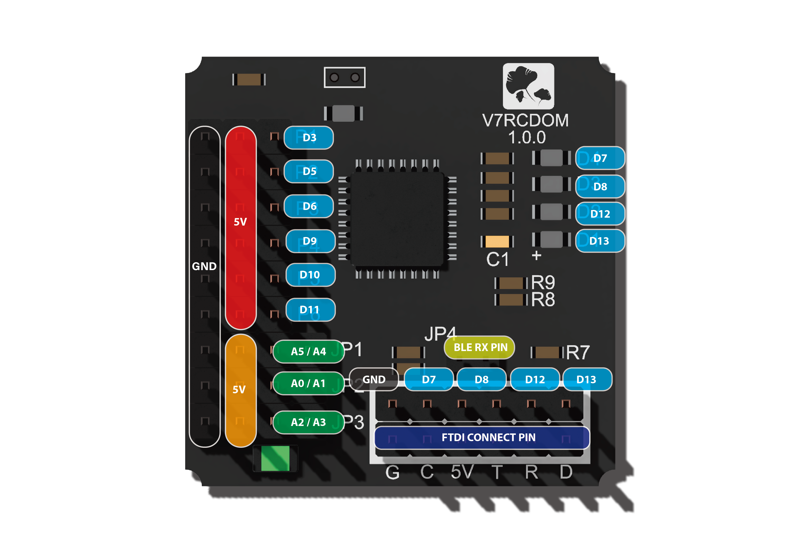

# V7RCDOM
This repository is used for maker to develop and download the last FW for V7RCDOM

專門給遙控車用的開發控制板，腳位設計方便遙控載具的連接習慣，讓遙控玩家很快的就能上手使用。
搭配V7RC APP, 直接改成手機控制遙控車。

Why V7RCDOM?

拿著遙控器去控制車輛、飛機、船、機器人一直都是從小到大的夢想，接上V7RC  APP有什麼不一樣，那就是不見得一定要用人控制，運用手機強大的運算，遙控車也可以實現AI控制。因此，我們就開始製作V7RCDOM，來實現這個夢想。

功能簡介：

1. 最多可以接上六個伺服馬達（也可以接上PWM訊號的電子變速器)
2. 使用PWM訊號控制馬達，有刷無刷馬達都相容。
3. 可以外接I2C或是SPI的Sensor, 像是電子羅盤、加速規或是陀螺儀。(使用3.3V)
4. 可以外接超音波感測器兩組。(使用3.3V)
5. 另外四個GPIO腳位可以控制LED燈號。
6. 1組UART提供作為更新韌體用。

開發板尺寸：

 31mm (長） X 31mm(寬）

技術規格：

1. ATMEL 328P MCU
2. Raytec Nordic 52832 BLE module.
3.  6 Channels PWM PIN (5V).
4. I2C / SPI PIN (3.3V) , or defined as 2 Analog PINs.
5. 3 Analog Pins ( Can used for Ultrasonic Sensor
6. 1 UART interface to flash firmware.

腳位圖

外觀照片

相關下載：

